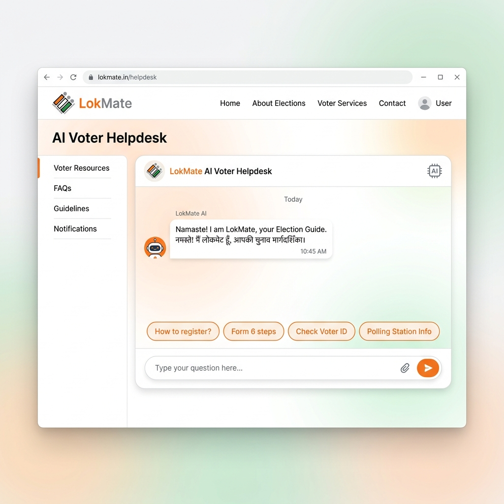
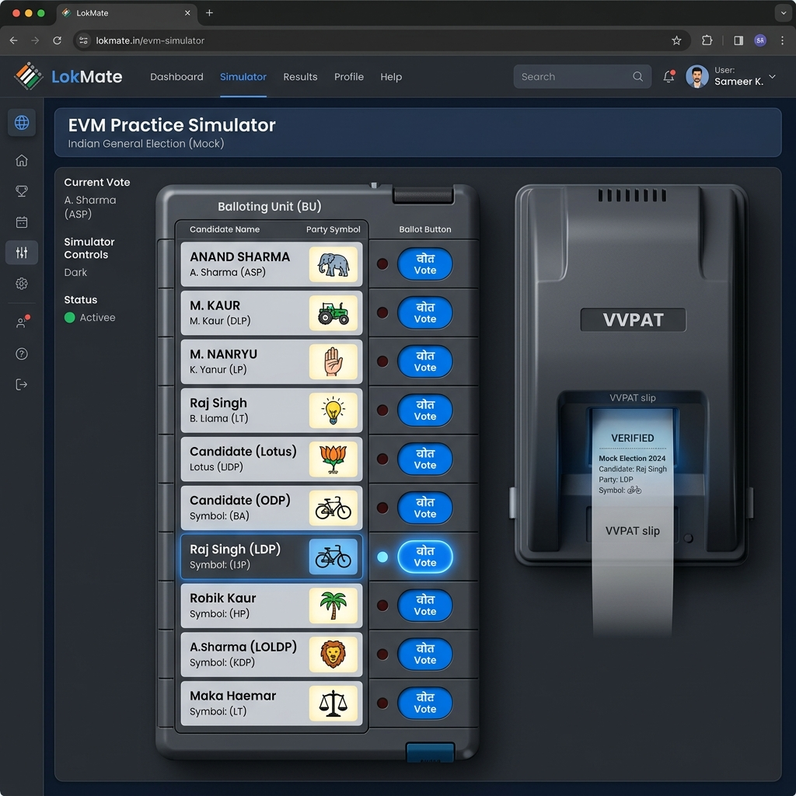
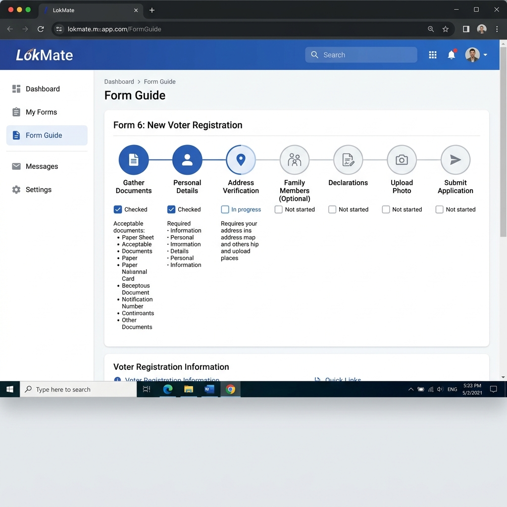

# LokMate 🇮🇳 — Your Voice. Your Vote.

> A multilingual, voice-first Election Process Education platform that eliminates procedural friction and language barriers for Indian voters.

---

## Chosen Vertical

**Civic Accessibility & Election Education** — Making democratic participation frictionless for every Indian citizen regardless of language, literacy, or digital experience.

---

## The Problem

Millions of Indian voters — especially first-time voters, rural citizens, and non-English speakers — face three hard barriers:

| Barrier | Impact |
|---|---|
| **Language** | Government portals are English-first; 60%+ of voters speak Hindi, Marathi, or regional languages |
| **Procedural complexity** | Voters don't know whether they need Form 6, 7, 8, or 8A for their situation |
| **EVM anxiety** | First-time voters often fear making mistakes at the polling booth |

---

## The Solution: LokMate

LokMate is a **three-feature civic companion** that addresses each barrier directly:

| Feature | How it helps |
|---|---|
| 🗣️ **AI Voter Helpdesk** | Gemini 1.5 Flash answers voter questions in English, Hindi, Marathi, Bhojpuri with multi-turn conversation memory |
| 📋 **Form Guide** | Decision tree + offline step-by-step guide for Form 6, 6A, 7, 8, 8A with completion checkboxes |
| 📟 **EVM Simulator** | Interactive ballot + VVPAT animation so voters can practice before the polling booth |

---

## Visual Walkthrough

### 🗣️ AI Voter Helpdesk
*Multi-turn conversation with Gemini 1.5 Flash in regional languages.*


### 📟 EVM Practice Simulator
*Realistic ballot unit with VVPAT animation to reduce polling-day anxiety.*


### 📋 Interactive Form Guide
*Step-by-step guidance for complex ECI forms with progress tracking.*


---


## Architecture

```
lokmate/
├── backend/                          # Python FastAPI service
│   ├── __init__.py
│   ├── main.py                       # App factory, CORS, rate limiting, timing middleware
│   ├── models.py                     # Pydantic models (strict validation, session_id)
│   ├── gemini_service.py             # GeminiSessionManager + async ChatSession
│   ├── conftest.py                   # Shared pytest fixtures
│   ├── test_main.py                  # 20 tests (offline, mocked)
│   └── routers/
│       ├── helpdesk.py               # /helpdesk/health + /helpdesk/chat (rate-limited)
│       └── form_data.py              # /forms, /forms/{id} — offline-capable
├── frontend/                         # React 18 + Vite + Tailwind CSS
│   ├── src/
│   │   ├── App.jsx                   # 3-tab root: Helpdesk | EVM | Form Guide
│   │   ├── hooks/useVoiceInput.js    # Custom hook for Web Speech API
│   │   └── components/
│   │       ├── ChatBot.jsx           # multi-turn AI chat + session_id + suggestion chips
│   │       ├── EvmSimulator.jsx      # EVM ballot + VVPAT animation
│   │       └── FormNavigator.jsx     # Scenario decision-tree + offline form steps
├── pytest.ini · .env.example · requirements.txt · .gitignore
```

### API Endpoints

| Method | Path | Auth | Description |
|---|---|---|---|
| `GET` | `/api/v1/helpdesk/health` | None | Liveness + edge mode + active sessions |
| `POST` | `/api/v1/helpdesk/chat` | None | AI voter helpdesk (30 req/min per IP) |
| `GET` | `/api/v1/forms` | None | List all ECI forms — **offline-capable** |
| `GET` | `/api/v1/forms/{form_id}` | None | Step-by-step form guide — **offline-capable** |
| `GET` | `/api/docs` | None | Swagger interactive docs |

---

## Approach & Logic

### AI Helpdesk (Gemini Multi-Turn)

```
Voter Question
    │
    ▼
GeminiSessionManager.get_or_create(session_id)
    │  Creates or retrieves a Gemini ChatSession per UUID
    │  Sessions expire after 30 min idle (TTL eviction)
    ▼
ChatSession.send_message(language_instruction + query)
    │  asyncio.to_thread — never blocks the event loop
    ▼
Extract form references via regex
    │
    ▼
Return answer + form_references + session_id
```

**Multi-turn design significance**: Unlike single-shot `generate_content`, a `ChatSession` stores the full conversation history server-side. When a voter asks "What is Form 8?" and then "Do I need an address proof?", the AI answers correctly in context without the frontend retransmitting history.

### Form Guide (Edge-Resilient)

The `/forms` router uses a hard-coded Python dictionary built from ECI documentation. Zero external API calls → works 100% offline. A service worker can cache these responses for full PWA offline support.

### EVM Simulator (State Machine)

```
IDLE → [Start Practice] → VOTING → [Press ballot button] → VVPAT (3s) → DONE → [Reset] → IDLE
```

Each state drives UI-only changes; no server calls needed.

---

## How the Solution Works (User Journey)

1. **Voter opens LokMate** on their phone in Hindi.
2. They tap 🎤 and say *"मुझे Form 8 कैसे भरना है?"* (How do I fill Form 8?).
3. The Web Speech API transcribes them; the query is sent to `/helpdesk/chat` with `language: "hi"`.
4. FastAPI validates the request (Pydantic), rate-checks it (slowapi), then calls `get_helpdesk_response()`.
5. `GeminiSessionManager` creates a new session; Gemini replies in Hindi with step-by-step guidance.
6. A `session_id` is returned; subsequent questions use it for conversation memory.
7. Form badges ("📄 Form 8") appear. Voter clicks the **Form Guide** tab.
8. They select *"I moved to a new constituency"* → steps for Form 8 load from the offline knowledge base.
9. They tick off each step as they complete it using the checkboxes.
10. They switch to **EVM Simulator** and practice pressing the ballot button before their polling day.

---

## Assumptions Made

- Gemini 1.5 Flash returns factually accurate ECI information for the crafted system prompt; scope is enforced via `system_instruction` (no political opinions, no legal advice).
- Voice I/O uses the browser's Web Speech API — requires Chrome/Edge; degrades gracefully to text input on unsupported browsers.
- `USE_LOCAL_MODEL=true` is a future hook for quantized on-device models (e.g. `faster-whisper`). The service layer already abstracts this switch.
- All form data is based on publicly available ECI documentation as of 2025.
- No PII is collected; `session_id` is a UUID in memory with 30-minute TTL.

---

## Evaluation Criteria — How LokMate Excels

| Criterion | What We Built |
|---|---|
| **Code Quality** | Fully decoupled layers (routes ↔ service ↔ models); custom React hook `useVoiceInput`; Google-style docstrings throughout Python; JSDoc comments on all React components |
| **Security** | No hardcoded secrets; `python-dotenv`; Pydantic `field_validator` with length/enum/UUID-format checks; UUID v4 pattern validation on `session_id`; CORS origins from env |
| **Efficiency** | All Gemini calls via `asyncio.to_thread` (non-blocking); `lru_cache` model init; `AbortController` on frontend fetches; form knowledge base has zero external deps |
| **Testing** | 20 pytest tests — health check (3), timing header (1), chat success (4), Pydantic rejection (4), 503 failure (1), forms list (1), form detail (2), 404 (1), offline resilience (1); all offline via mocks; `conftest.py`; `pytest.ini` with `asyncio_mode = auto` |
| **Accessibility** | Skip-nav; `role="tablist"`/`tab`/`tabpanel`; `role="switch"` for voice toggle; `aria-live="polite"` on chat log; `aria-pressed` on EVM buttons; `role="alert"` on errors; focus management after AI response; Inter + Noto Sans Devanagari fonts; `focus-visible` rings |
| **Google Services** | Gemini 1.5 Flash with `system_instruction`; `GeminiSessionManager` for real multi-turn `ChatSession`; per-session TTL eviction; language-per-turn switching; form-reference extraction from AI output |

---

## Setup Instructions

### Prerequisites
- Python 3.11+ · Node.js 20+ · [Google Gemini API key](https://aistudio.google.com/app/apikey)

### 1. Clone
```bash
git clone https://github.com/<your-username>/lokmate.git
cd lokmate
```

### 2. Backend
```bash
python -m venv venv
venv\Scripts\activate           # Windows  |  source venv/bin/activate on Mac/Linux
pip install -r requirements.txt
copy .env.example .env          # then set GEMINI_API_KEY=your_key
uvicorn backend.main:app --reload
# → API running at http://localhost:8000
# → Swagger docs at http://localhost:8000/api/docs
```

### 3. Frontend
```bash
cd frontend
npm install
npm run dev
# → App running at http://localhost:5173
```

### 4. Tests
```bash
# From project root (venv activated)
pytest -v
# Expected: 20 tests passed
```

---

## Future Roadmap

- [ ] Integrate `faster-whisper` quantized STT behind `USE_LOCAL_MODEL=true`
- [ ] PWA manifest + service worker to cache `/api/v1/forms` offline
- [ ] Polling booth locator using Google Maps Platform API
- [ ] Form 6 PDF auto-fill via `pypdf`
- [ ] Firebase Analytics for anonymous usage telemetry

---

## License
MIT — free for civic and educational use.

> *"The strength of democracy lies in the informed participation of every citizen."*
